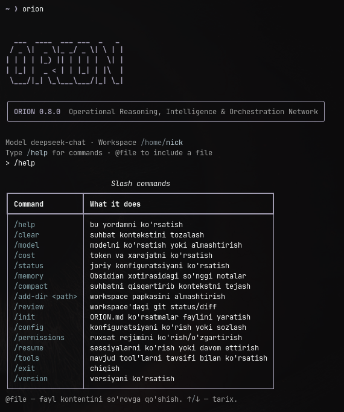
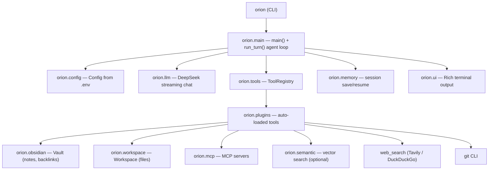

# ORION

**Operational Reasoning, Intelligence & Orchestration Network** — a terminal AI assistant that gives DeepSeek a long-term memory in Obsidian and hands to work in your code projects.

[](https://github.com/BotirBakhtiyarov/orion-second-brain/actions/workflows/ci.yml)
[](https://www.python.org/)
[](LICENSE)
[](https://github.com/BotirBakhtiyarov/orion-second-brain/releases)

## What is ORION?

ORION is a personal AI assistant that lives in your terminal and works with two
worlds at once:

- **An Obsidian vault** — your long-term memory and knowledge base. ORION
  decides on its own which parts of a conversation are worth keeping, writes
  them as Markdown notes, links related notes together, and keeps the vault
  organized.
- **A workspace** — the folder with your code and files. ORION can read, edit,
  run and improve your projects, with a permission prompt before anything
  sensitive happens.

Unlike a plain chat window, ORION remembers across sessions, is honest about
what it does, and can actually take action on your machine.

**Who is it for?** Developers and Obsidian users who want an agentic assistant
with durable, plain-text, local memory — and a Claude Code-style workflow that
reads like a real tool, not a toy.

## Demo

### Terminal



### Second brain in Obsidian


ORION runs entirely in the terminal. On startup it prints this banner:

```text
  ___  ____  ___ ___  _   _
 / _ \|  _ \|_ _/ _ \| \ | |
| | | | |_) || | | | |  \| |
| |_| |  _ < | | |_| | |\  |
 \___/|_| \_\___\___/|_| \_|

╭──────────────────────────────────────────────────────────────────────────╮
│ ORION 0.8.0  Operational Reasoning, Intelligence & Orchestration Network │
╰──────────────────────────────────────────────────────────────────────────╯
```

## Features

- **Smart memory** — ORION autonomously decides what to persist to Obsidian and
  what to skip, via the `save_memory` tool and explicit rules in the system
  prompt.
- **Agent mode** — for multi-step tasks ORION records a plan (the `plan` tool),
  executes steps one by one, and shows progress in the terminal.
- **Obsidian toolkit** — search, read, create, update, append, list, two-way
  backlinks, pretty notes (YAML frontmatter + `[[wikilinks]]`), daily notes and
  Inbox triage.
- **Project work** — `list_files`, `read_file`, `write_file`, `edit_file`,
  `run_command` inside a sandboxed workspace (path-traversal protected).
- **Git integration** — `git_status`, `git_diff`, `git_log`, `git_commit`,
  `git_create_pr`.
- **Web search** — `web_search` via Tavily (set `TAVILY_API_KEY`) or a
  key-less DuckDuckGo fallback.
- **System tools** — open URLs/apps, notifications, clipboard, screenshots,
  current time.
- **MCP support** — connect any [Model Context Protocol](https://modelcontextprotocol.io)
  server (Gmail, Slack, fetch, time, …).
- **Semantic search (optional)** — vector search with `fastembed`, blended with
  keyword search. The model is only downloaded during an explicit `reindex` —
  search never hangs on a hidden download.
- **Streaming responses**, token/cost tracking, session persistence
  (`orion -c` to resume), and automatic backups on note updates.
- **Auto-memory** — on exit ORION can summarize the session and extract
  important facts into Obsidian.

## Quick Start

```bash
# 1. Clone
git clone https://github.com/BotirBakhtiyarov/orion-second-brain.git
cd orion-second-brain

# 2. Install (uv is the project's package manager)
uv sync

# 3. Configure
cp .env.example .env
# then edit .env and set DEEPSEEK_API_KEY and OBSIDIAN_VAULT

# 4. Run
uv run orion
```

Prefer pip? `pip install -e ".[dev]"` works the same way.

To run `orion` from any directory, install it as a global tool:

```bash
uv tool install --editable .
# also enable semantic search and MCP in the global install:
uv tool install --editable --with "fastembed" --with "mcp<2" .
```

## Usage

### CLI

```bash
orion                       # interactive session
orion -c                    # continue the most recent session
orion -r <id>               # resume a session by ID
orion -p "summarize @README.md"   # one-shot: print the answer and exit
orion "add error handling to @src/app.py"  # start interactive with a prompt
orion --workspace /path/to/projects
orion config                # show the resolved configuration
orion config --init         # create .env from .env.example
orion config --edit         # open .env in $EDITOR
```

Flags: `-p/--print`, `-c/--continue`, `-r/--resume ID`, `-v/--version`,
`--model`, `--vault`, `--workspace`, `--dangerously-skip-permissions`.

### Slash commands

| Command | What it does |
|---|---|
| `/help` | show all commands |
| `/clear` | clear the conversation context |
| `/model [name]` | show or switch the model |
| `/cost` | token usage and cost so far |
| `/status` | current configuration |
| `/memory` | recent notes in Obsidian |
| `/compact` | summarize the conversation to save context |
| `/add-dir <path>` | switch the workspace directory |
| `/review` | git status/diff in the workspace |
| `/init` | create an `ORION.md` project instructions file |
| `/config [init\|edit]` | view or initialize configuration |
| `/permissions [on\|bypass]` | view or change the permission mode |
| `/resume [id]` | list sessions or resume one |
| `/tools` | list available tools |
| `/exit` | exit ORION |

- `@file` — include a file's content in your prompt (e.g. `@src/app.py`).
- `↑` / `↓` — prompt history.
- `ORION.md` at the workspace root is read automatically at session start
  (like `CLAUDE.md` in Claude Code).
- Sensitive tools (`run_command`, `screenshot`, `git_commit`, `git_create_pr`)
  ask for permission before running. Disable with
  `--dangerously-skip-permissions` or `/permissions bypass`.

### Tools

ORION exposes these tools to the model (run `/tools` to see them live):

| Area | Tools |
|---|---|
| Obsidian | `search_notes`, `read_note`, `create_note`, `update_note`, `append_to_note`, `list_notes`, `link_notes` |
| Memory | `save_memory`, `daily_note`, `triage_inbox`, `reindex` |
| Workspace | `list_files`, `read_file`, `write_file`, `edit_file`, `run_command` |
| Git | `git_status`, `git_diff`, `git_log`, `git_commit`, `git_create_pr` |
| Web | `web_search` |
| Agent | `plan` |
| System | `open_url`, `open_app`, `notify`, `clipboard_copy`, `clipboard_read`, `screenshot`, `get_time` |
| MCP | `mcp__<server>__<tool>` (when configured) |

## Configuration

ORION reads a `.env` file from the current directory first, then from
`~/.orion/.env` (useful for a global install). `orion config --init` creates one
from `.env.example`.

| Variable | Required | Default | Purpose |
|---|---|---|---|
| `DEEPSEEK_API_KEY` | yes | — | DeepSeek API key |
| `OBSIDIAN_VAULT` | yes | — | Absolute path to your Obsidian vault |
| `DEEPSEEK_BASE_URL` | no | `https://api.deepseek.com` | API base URL (any OpenAI-compatible endpoint) |
| `DEEPSEEK_MODEL` | no | `deepseek-chat` | Model name |
| `WORKSPACE` | no | current directory | Root folder for project file operations |
| `TAVILY_API_KEY` | no | — | Enables Tavily for `web_search` (falls back to DuckDuckGo) |
| `ORION_HISTORY` | no | `~/.orion/history.json` | Session history location |
| `ORION_MAX_HISTORY` | no | `50` | Max messages kept in context |
| `DEEPSEEK_INPUT_PRICE` | no | `0.27` | USD per 1M input tokens (cost estimate) |
| `DEEPSEEK_OUTPUT_PRICE` | no | `1.10` | USD per 1M output tokens (cost estimate) |
| `ORION_AUTO_MEMORY` | no | `1` | Set to `0` to disable session-end memory extraction |

`WORKSPACE` defaults to the directory your terminal is in, so
`cd ~/my-project && orion` uses `~/my-project` as the workspace.

## Architecture



The loop is simple and synchronous:

1. `main()` loads config, builds the tool registry (auto-loading `orion/plugins/`
   plus the `plan` tool), and reads `ORION.md` into the system prompt.
2. Each user turn calls `run_turn()`, which streams a DeepSeek completion.
3. If the model requests tools, ORION executes them (asking permission for
   sensitive ones), appends the results, and loops until the model answers.
4. Sessions are persisted to JSON and can be resumed with `orion -c`.

## Tech stack

- **Python 3.11+** with a `src`-style package (`orion/`)
- **DeepSeek** (OpenAI-compatible API) via the `openai` client
- **Rich** and **prompt_toolkit** for the terminal UI
- **python-dotenv** for configuration
- **Obsidian** vault as plain-Markdown storage
- Optional: **fastembed** (ONNX, no PyTorch) for semantic search, **mcp** for MCP servers
- **uv** for packaging/environments, **Ruff** for lint/format, **pytest** for tests, **GitHub Actions** for CI

## Project structure

```text
.
├── orion/
│   ├── main.py          # CLI entry point, slash commands, run_turn() agent loop
│   ├── config.py        # Config dataclass + .env loading
│   ├── llm.py           # DeepSeek streaming/one-shot chat helpers
│   ├── tools.py         # Tool base class + ToolRegistry
│   ├── prompts.py       # System prompt (memory / coding / agent rules)
│   ├── memory.py        # Session save / resume / list (JSON)
│   ├── obsidian.py      # Vault: notes, search, frontmatter, backlinks
│   ├── workspace.py     # Workspace: sandboxed file operations
│   ├── semantic.py      # Optional vector search (fastembed)
│   ├── mcp.py           # MCP client manager
│   ├── ui.py            # Rich rendering helpers
│   ├── agent.py         # Plan + PlanTool (agent mode)
│   └── plugins/         # Auto-loaded tools
│       ├── obsidian_plugin.py
│       ├── memory_plugin.py
│       ├── code_plugin.py
│       ├── git_plugin.py
│       ├── web_plugin.py
│       ├── system_plugin.py
│       └── mcp_plugin.py
├── tests/               # pytest suite
├── docs/                # additional documentation
├── .github/workflows/   # CI and release automation
├── pyproject.toml       # project + tooling config
├── .env.example         # configuration template
└── README.md
```

### Writing a plugin

Drop a new `.py` file into `orion/plugins/` — it is loaded automatically. Every
plugin file must define a `register(registry, config)` function:

```python
from orion.tools import Tool


def register(registry, config):
    registry.register(MyTool())


class MyTool(Tool):
    def __init__(self):
        super().__init__(
            name="my_tool",
            description="What this tool does and when to use it",
            parameters={
                "arg1": {"type": "string", "description": "..."},
            },
            required=["arg1"],
        )

    def execute(self, arg1):
        # the actual work happens here
        return {"result": arg1}
```

## MCP support

ORION speaks the Model Context Protocol, so it can use the same servers as
Claude Code. Install the extra and create `~/.orion/mcp.json`:

```bash
pip install -e ".[mcp]"
```

```json
{
  "mcpServers": {
    "time": { "command": "uvx", "args": ["mcp-server-time"] },
    "fetch": { "command": "uvx", "args": ["mcp-server-fetch"] }
  }
}
```

Each MCP tool appears as `mcp__<server>__<tool>`. If `mcp` is not installed or
the config is missing, ORION runs normally without it.

## Testing

```bash
uv run pytest            # everything (the network test self-skips if offline)
uv run pytest -m "not network"   # skip tests that download models
uv run ruff check .      # lint
uv run ruff format --check .     # formatting
```

Some tests need the optional extras:
`tests/test_mcp.py` requires `mcp`, and `tests/test_semantic.py` requires
`fastembed` (both are skipped automatically when the extra is missing).

## Contributing

Contributions are welcome. Please read [CONTRIBUTING.md](CONTRIBUTING.md) for
setup, coding conventions and the pull request process. All participants are
expected to follow our [Code of Conduct](CODE_OF_CONDUCT.md). New here? Check
the [good first issues](docs/good-first-issues.md).

## License

This project is licensed under the [MIT License](LICENSE).

## Roadmap

Planned or desired improvements (none of these exist yet):

- Obsidian Local REST API transport as an alternative to direct file access.
- A web UI / graph view over the vault.
- Autonomous background tasks (e.g. an end-of-day vault tidy).
- Telegram / Discord bot mode.
- RAG over code and notes together.
